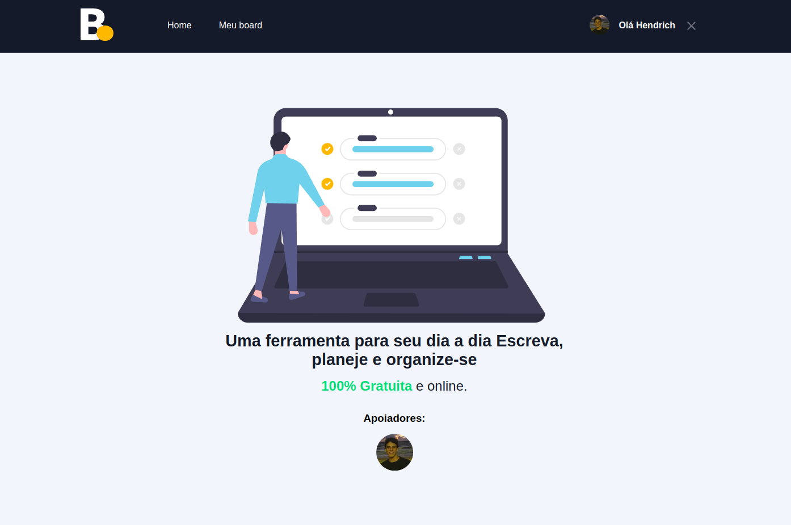
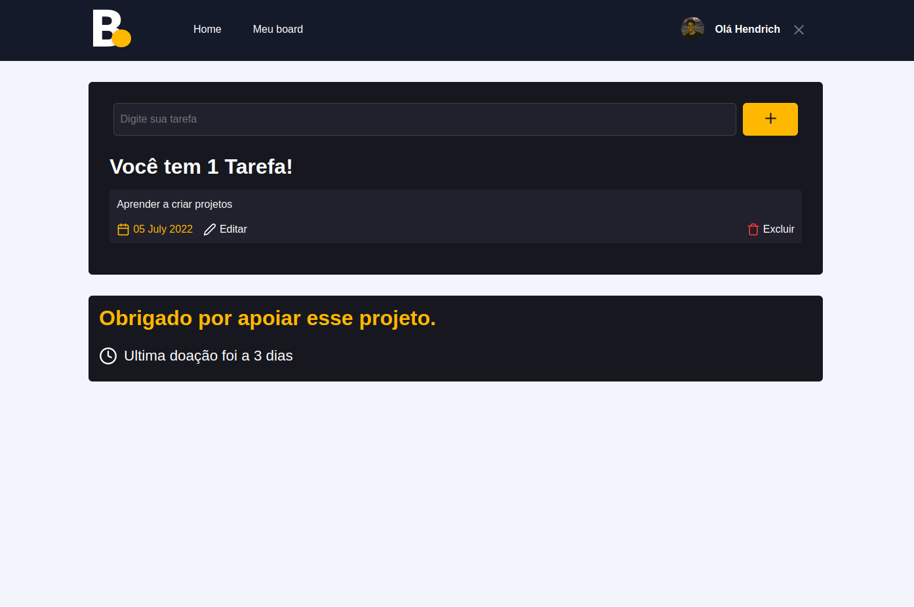

# Task Board

 

- ReactJS
- NextJS
- Typescript
- SCSS

- CMS: Prismic
- OAuth: GitHub
- FireBase
- Paypal payment

  

## Projeto

# Projeto

   
   

   

## Funcionalidades

- Cadastrar usuario (GitHub Auth)
- Realizar pagamento de premium (Paypal)
- Criação de taskLists (deletar/editar/adicionar)
- Página para o apoiador

 

## Manual de Uso
 

### Instalação

- `yarn`
 

#### Incialize

- `yarn dev`
   

- `http://localhost:3000/`
